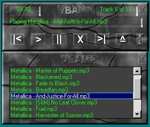



## API MP3 & CD PLAYER\(UPDATED\)

### Description

Its A big d/l (~370kb) but its worth it. This is just about a fully functional MP3 & CD player. It has a nice GUI and toon of options. Some of those options are: play,pause,stop,resume,repeat,random,playlist,save list,load list,and lots more. I will be updating ASAP to add some stuff like mp3 to wav wave to mp3 and possably a cd ripper. PS you can save and load winamp playlist. Now has save settings, and skinnable and much more!
 
### More Info
 

             |
---                |---
**Submitted On**   |2000-10-27 15:47:10
**By**             |[Ross Goodin](https://github.com/Planet-Source-Code/PSCIndex/blob/master/ByAuthor/ross-goodin.md)
**Level**          |Intermediate
**User Rating**    |4.7 (80 globes from 17 users)
**Compatibility**  |VB 5\.0, VB 6\.0
**Category**       |[Sound/MP3](https://github.com/Planet-Source-Code/PSCIndex/blob/master/ByCategory/sound-mp3__1-45.md)
**World**          |[Visual Basic](https://github.com/Planet-Source-Code/PSCIndex/blob/master/ByWorld/visual-basic.md)
**Archive File**   |[CODE\_UPLOAD1207611262000\.zip](https://github.com/Planet-Source-Code/ross-goodin-api-mp3-cd-player-updated__1-12006/archive/master.zip)

